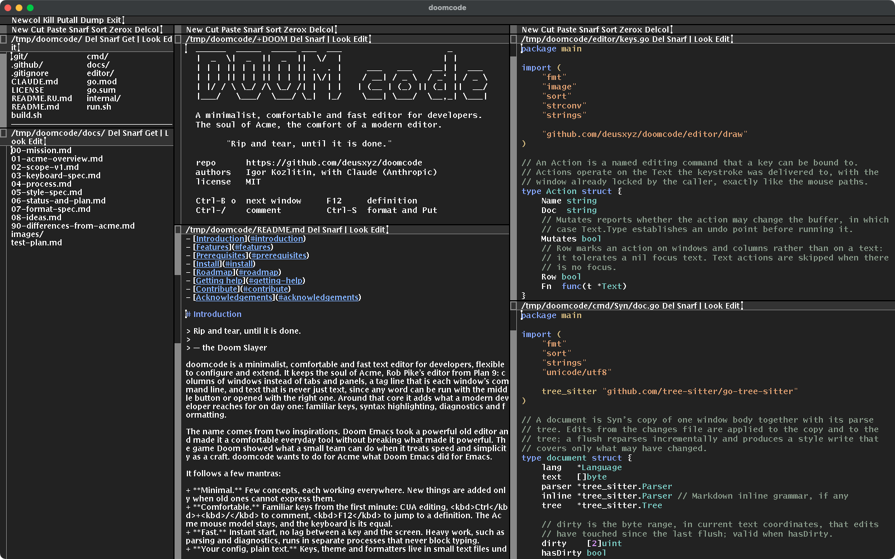

<div align="center">

# doomcode

[English](README.md) | **Русский**

[Установка](#установка) • [Возможности](#возможности) • [Клавиши](#помощь) • [Документация](docs/) • [Планы](#планы) • [Участие](#участие)

[](https://github.com/deusxyz/doomcode/actions/workflows/doomcode.yml)

-lightgrey?style=flat-square&logo=apple&logoColor=white)
-compatible-8a2be2?style=flat-square)
[](LICENSE)




</div>

---

### Содержание
- [Введение](#введение)
- [Возможности](#возможности)
- [Что нужно](#что-нужно)
- [Установка](#установка)
- [Планы](#планы)
- [Помощь](#помощь)
- [Участие](#участие)
- [Благодарности](#благодарности)

# Введение

> Rip and tear, until it is done.
>
> — Палач Рока (Doom Slayer)

doomcode — минималистичный, удобный и быстрый текстовый редактор для разработчиков, с гибкой настройкой и расширением. Он сохраняет душу Acme, редактора Роба Пайка из Plan 9: колонки окон вместо вкладок и панелей, тег как командная строка окна и текст, который никогда не бывает просто текстом, ведь любое слово можно выполнить средней кнопкой мыши или открыть правой. Вокруг этого ядра — то, что современный разработчик ищет в первый же день: привычные клавиши, подсветка синтаксиса, диагностика и форматирование.

Имя пришло из двух источников. Doom Emacs взял мощный старый редактор и сделал его удобным ежедневным инструментом, не сломав того, что делало его мощным. Игра Doom показала, на что способна маленькая команда, когда относится к скорости и простоте как к ремеслу. doomcode хочет сделать с Acme то, что Doom Emacs сделал с Emacs. Подробнее — в [миссии проекта](docs/00-mission.md).

Несколько принципов:

+ **Минимализм.** Мало понятий, и каждое работает везде. Новое добавляется, только если его нельзя выразить старым.
+ **Удобство.** Привычные клавиши с первой минуты: CUA, <kbd>Ctrl</kbd>+<kbd>/</kbd> для комментариев, <kbd>F12</kbd> к определению. Мышиная модель Acme остаётся, клавиатура ей равноправна.
+ **Скорость.** Мгновенный запуск, отклик без задержек. Тяжёлая работа, разбор и диагностика, идёт в отдельных процессах и не тормозит ввод.
+ **Настройки — простой текст.** Клавиши, тема и форматтеры лежат в маленьких текстовых файлах в `~/.config/doomcode`. Всё, что захочется поменять, — конфигурация, а не код.
+ **Расширения — обычные программы.** Расширить редактор может любая программа, которая читает и пишет файлы через интерфейс acme(4): так работают `Syn`, `Diag` и acme-lsp. Своего языка расширений учить не нужно.

# Возможности

- Модель Acme целиком: колонки, окна, теги, аккорды мыши, plumber, язык команд `Edit`, терминалы `win`.
- CUA-клавиши: стрелки двигают курсор, выделение с <kbd>Shift</kbd>, <kbd>Ctrl</kbd>+<kbd>C</kbd>/<kbd>X</kbd>/<kbd>V</kbd>/<kbd>Z</kbd>/<kbd>Y</kbd>, <kbd>Ctrl</kbd>+<kbd>S</kbd> сохраняет, переходы по словам с <kbd>Option</kbd> или <kbd>Ctrl</kbd>; на macOS дубли на <kbd>Cmd</kbd>.
- Префикс <kbd>Ctrl</kbd>+<kbd>B</kbd> в стиле tmux для окон и колонок: фокус, создание, закрытие, распахивание, перестановка, список окон.
- Клавиатурные аналоги мыши: <kbd>Ctrl</kbd>+<kbd>E</kbd> выполняет как кнопка 2, <kbd>Ctrl</kbd>+<kbd>O</kbd> открывает как кнопка 3; поиск и переход к строке через тег.
- Подсветка синтаксиса на tree-sitter для Go, C, JSON, shell, Rust, Python, JavaScript, TypeScript и Markdown, включая код в fenced-блоках; ошибки разбора отмечаются при наборе.
- Возможности языковых серверов через acme-lsp: диагностика прямо в тексте, переход к определению, ссылки, переименование, дополнение, подсказки — всё на клавишах.
- Форматирование при сохранении любым фильтром (по умолчанию `gofmt`), комментирование под язык файла.
- Все клавиши, тема и форматтеры настраиваются в простых файлах и перечитываются без перезапуска.

# Что нужно

+ Обязательно:
  + Go 1.24 или новее и компилятор C для грамматик tree-sitter
  + [plan9port](https://github.com/9fans/plan9port): `devdraw` (окно), `rc` и `9p`
+ По желанию:
  + [acme-lsp](https://github.com/fhs/acme-lsp) и языковой сервер, например `gopls`, для диагностики и навигации по коду
  + форматтеры для ваших языков (`gofmt` идёт вместе с Go)

> [!IMPORTANT]
> Спецклавишам с модификаторами (<kbd>Shift</kbd>+стрелки, <kbd>Ctrl</kbd>+<kbd>Enter</kbd>, <kbd>Option</kbd>+стрелки) нужен небольшой патч `devdraw` из ветки `devdraw/modkeys` форка [deusxyz/plan9port](https://github.com/deusxyz/plan9port). Без него всё остальное работает, просто эти клавиши приходят без модификаторов.

> [!NOTE]
> doomcode разрабатывается и используется на macOS. Сборка пропатченного `devdraw` для Linux написана, но ещё не проверена.

# Установка

```sh
git clone https://github.com/deusxyz/doomcode
cd doomcode
./build.sh                # bin/doomcode, bin/Syn, bin/Diag
./run.sh                  # запуск редактора
```

`run.sh` указывает редактору `devdraw` из plan9port и даёт ему своё пространство имён, поэтому doomcode может работать рядом с plan9port acme. Подсветка включается командой `Syn` из любого тега, диагностика — запуском `acme-lsp`, затем `Diag`.

# Планы

- [Состояние и план](docs/06-status-and-plan.md): что сделано, что отложено и почему.
- [Идеи](docs/08-ideas.md): куда doomcode может двинуться дальше, начиная с Org mode на Markdown.
- [План ручной проверки](docs/test-plan.md): что ещё ждёт человека с клавиатурой.

# Помощь

Документация — в [docs/](docs/). Все привязки описаны в [спецификации клавиатуры](docs/03-keyboard-spec.md); в редакторе команда `Keys` показывает действующие привязки, `Keys actions` — всё, что можно повесить на клавишу.

Для начала:

| Клавиши | Действие |
|---|---|
| <kbd>Ctrl</kbd>+<kbd>E</kbd> / <kbd>Ctrl</kbd>+<kbd>O</kbd> | выполнить / открыть слово под курсором, как кнопки 2 и 3 |
| <kbd>Ctrl</kbd>+<kbd>F</kbd>, <kbd>Ctrl</kbd>+<kbd>G</kbd> | поиск, переход к строке |
| <kbd>Ctrl</kbd>+<kbd>/</kbd> | закомментировать или раскомментировать строки |
| <kbd>F12</kbd>, <kbd>F2</kbd> | к определению, переименовать (с acme-lsp) |
| <kbd>Ctrl</kbd>+<kbd>B</kbd> <kbd>←</kbd><kbd>→</kbd><kbd>↑</kbd><kbd>↓</kbd> | переход между окнами и колонками |
| <kbd>Ctrl</kbd>+<kbd>B</kbd> <kbd>c</kbd> / <kbd>x</kbd> / <kbd>z</kbd> | новое окно / закрыть / распахнуть |

Нашли ошибку или есть вопрос? [Откройте issue](https://github.com/deusxyz/doomcode/issues).

# Участие

doomcode пишут **Игорь Козлитин** ([@deusxyz](https://github.com/deusxyz)) и **Claude** (Anthropic). Большую часть кода пишет Claude в разговоре с Игорем, который задаёт направление, принимает решения и проверяет каждое изменение руками; решения и их причины записаны в [docs/](docs/).

Issues и pull request'ы приветствуются. Перед крупным изменением откройте issue, чтобы обсудить: проект старается оставаться маленьким, и каждая новая функция сначала должна показать, что её не покрывают уже существующие инструменты вроде acme-lsp.

# Благодарности

- [Acme](http://acme.cat-v.org/) Роба Пайка и [plan9port](https://github.com/9fans/plan9port) Расса Кокса, перенёсший Plan 9 в Unix.
- [Edwood](https://github.com/rjkroege/edwood) Роба Крёгера и соавторов: редактор doomcode начинался как его форк.
- [tree-sitter](https://tree-sitter.github.io/) и его грамматики, [acme-lsp](https://github.com/fhs/acme-lsp).
- [Doom Emacs](https://github.com/doomemacs/doomemacs) и Doom от id Software — за вдохновение.

doomcode не связан с id Software, Bethesda и проектом Doom Emacs.

[MIT](LICENSE), © 2026 Igor Kozlitin. Код редактора в `editor/`, унаследованный от Edwood, plan9port и Project Serenity, остаётся под условиями [editor/LICENSE](editor/LICENSE) (BSD-3-Clause и MIT); их уведомления сохраняются.
